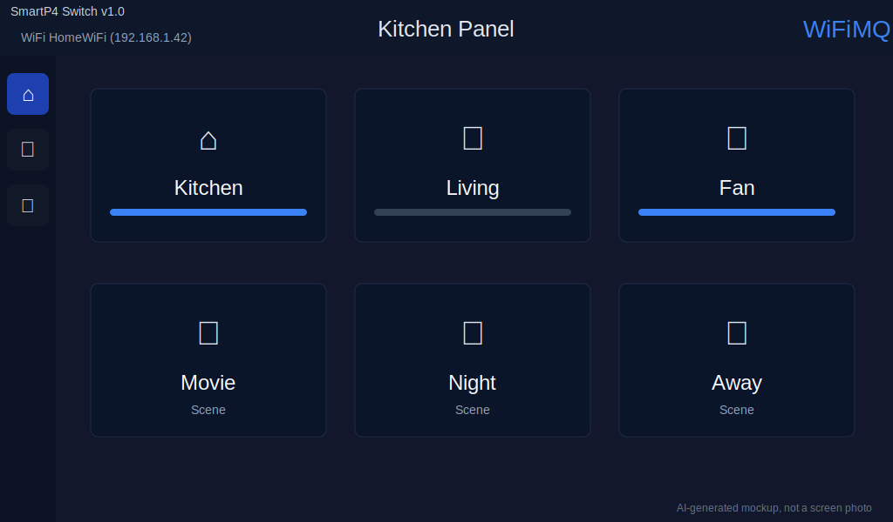
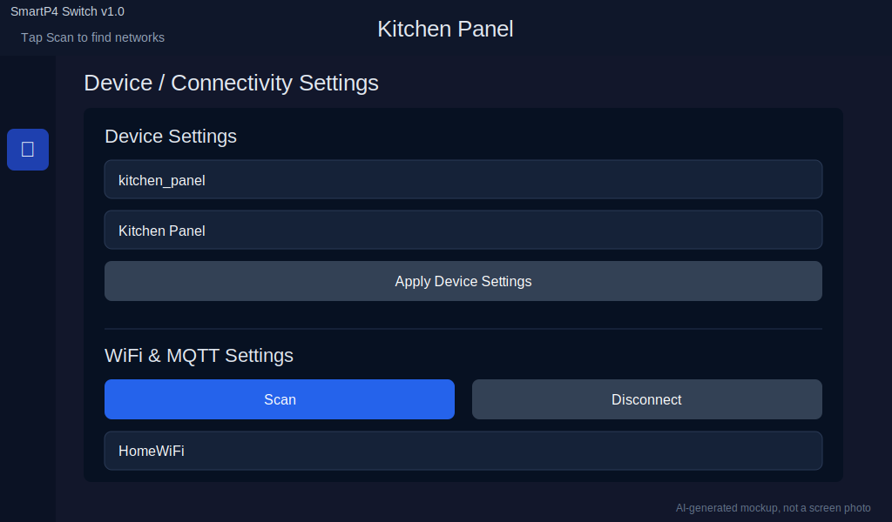
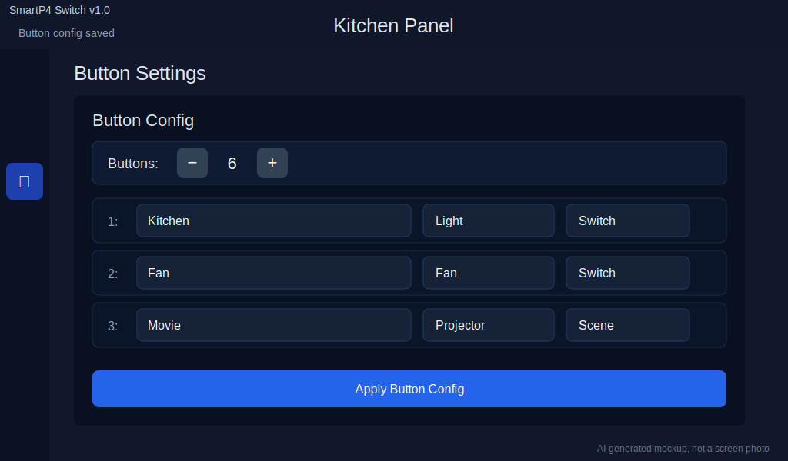

# SmartP4 Switch

SmartP4 Switch turns an ESP32-P4 7-inch touchscreen into a Home Assistant MQTT control panel. It is designed for home deployments where a wall, desk, or shelf display should expose a small set of reliable controls without needing a browser dashboard.

The firmware provides:

- A touch UI built with LVGL.
- Up to 6 configurable buttons.
- Switch buttons that sync state with Home Assistant over MQTT.
- Scene buttons that publish MQTT trigger events for Home Assistant automations.
- On-device WiFi, MQTT, device, and button configuration.
- MQTT availability so Home Assistant can show whether the device is online.

## Hardware

This project targets the GUITION/SpotPear-style `JC1060P470C` ESP32-P4 7-inch touchscreen board, sold under listings such as:

- AliExpress listing supplied for this project: https://www.aliexpress.us/item/3256811927030877.html
- Reference user guide: https://spotpear.com/wiki/ESP32-P4-Display-7inch-TouchScreen-JC1060P470C.html
- Board overview article: https://www.cnx-software.com/2025/05/06/7-inch-esp32-p4-wireless-touchscreen-display-supports-guition-designer-for-lvgl-arduino-and-esp-idf-programming/

Common board characteristics:

- ESP32-P4 main MCU.
- ESP32-C6 companion chip for WiFi/Bluetooth connectivity.
- 7-inch 1024 x 600 capacitive touchscreen.
- 16 MB flash and PSRAM.
- USB-C for power/programming.
- TF/microSD slot and expansion connectors, depending on kit variant.

This firmware is configured for `esp32p4`, 16 MB flash, PSRAM, LVGL, and the board support components already included in the repository.

## Requirements

You need:

- The supported ESP32-P4 7-inch touchscreen board.
- USB-C cable that supports data.
- ESP-IDF installed and exported in your shell.
- Home Assistant running on your network.
- MQTT enabled in Home Assistant, usually with the Mosquitto broker add-on.
- A 2.4 GHz WiFi network reachable by the device.

ESP-IDF 5.5 is known to build this repository. ESP32-P4 support requires a recent ESP-IDF release.

## Build And Flash

From the repository root:

```bash
source ~/esp/esp-idf/export.sh
idf.py set-target esp32p4
idf.py build
```

Connect the board over USB-C. Find the serial port:

```bash
idf.py -p PORT flash monitor
```

Replace `PORT` with your device port, for example:

```bash
idf.py -p /dev/tty.usbmodemXXXX flash monitor
```

To leave the serial monitor, press `Ctrl+]`.

The build uses:

- `sdkconfig.defaults` for ESP32-P4, 16 MB flash, PSRAM, LVGL, and WiFi hosted support.
- `partitions.csv` with NVS, PHY data, an 8 MB factory app partition, and a 7 MB SPIFFS storage partition.

## First Boot

On first boot the device may show WiFi as disconnected because no credentials have been saved yet.

Use the touchscreen:

1. Open the settings tab.
2. Tap `Scan`.
3. Select your WiFi network.
4. Enter the WiFi password.
5. Enter device and MQTT settings.
6. Tap `Save & Connect`.

Saved settings are stored in NVS, so they survive reboot and power loss.

## Device Settings

The Device Settings section controls how the device identifies itself in MQTT and Home Assistant.

| Field | Example | Required | Meaning |
| --- | --- | --- | --- |
| Device ID / MQTT root | `espSwitch` | Yes | Root MQTT topic and unique ID prefix. All button topics are built from this value. |
| Device Name | `Kitchen Wall Switch` | Yes | Friendly name shown on the device header and in Home Assistant device metadata. |

### Device ID Rules

Recommended format:

- Use lowercase letters, numbers, underscores, or hyphens.
- Avoid spaces.
- Keep it stable after Home Assistant entities are created.

Examples:

- `kitchen_switch`
- `livingroom_panel`
- `bedroom_p4`

The default Device ID is:

```text
espSwitch
```

With that default, button 1 uses:

```text
espSwitch/btn1/state
espSwitch/btn1/set
espSwitch/btn1/label
```

Changing the Device ID changes the MQTT topics and Home Assistant unique IDs. If you change it after setup, Home Assistant may create new entities instead of reusing the old ones.

## WiFi And MQTT Settings

| Field | Example | Required | Meaning |
| --- | --- | --- | --- |
| WiFi network | `HomeWiFi` | Yes | SSID selected from scan results. |
| Password | `your-wifi-password` | Usually | WiFi password. Leave blank only for open networks. |
| MQTT Broker IP / host | `192.168.1.10` or `mqtt://homeassistant.local` | Yes for Home Assistant integration | MQTT broker hostname, IP, or full URI. If no URI scheme is supplied, firmware prepends `mqtt://`. |
| MQTT User | `smartp4` | Depends on broker | MQTT username. For Mosquitto, create a Home Assistant user or broker user. |
| MQTT Password | `secret` | Depends on broker | MQTT password for the user above. |

Buttons:

- `Scan`: scans nearby WiFi networks.
- `Connect`: connects using the current screen values and saves device/MQTT settings.
- `Save & Connect`: saves device, WiFi, and MQTT settings, then connects.
- `Disconnect`: disconnects WiFi and stops MQTT.

## Button Settings

Open the button settings tab to configure what appears on the main screen.

| Field | Range | Meaning |
| --- | --- | --- |
| Buttons | 1 to 6 | Number of active buttons shown on the main screen. |
| Name | Up to 15 characters | Label shown on the device button. |
| Icon | 21 choices | LVGL symbol shown above the label. |
| Type | `Switch` or `Scene` | Determines MQTT behavior. |

Available icons:

```text
Audio, Battery, Bell, Bluetooth, Charge, Eye, Fan, GPS, Home, Light,
Loop, Mail, Phone, Power, Projector, Settings, Speaker, Trash, Warning,
Water, WiFi
```

Tap `Apply Button Config` after editing buttons. The main screen and MQTT/Home Assistant configuration are refreshed after saving.

## Button Types

### Switch

A switch button is a stateful Home Assistant switch.

When tapped on the device:

- The device toggles local UI state.
- It publishes `ON` or `OFF` to the button state topic.

When controlled from Home Assistant:

- Home Assistant publishes to the command topic.
- The device updates the local button state.
- The device publishes the resulting state back to MQTT.

Accepted command payloads:

- On: `ON`, `on`, `yes`, `true`, `1`, `T`, `t`
- Off: `OFF`, `off`, `no`, `false`, `0`

### Scene

A scene button is stateless and send-only.

When tapped on the device:

- The device publishes `PRESS` to the action topic.
- It does not subscribe to a command topic.
- It does not keep an on/off state.

Use scene buttons for Home Assistant automations such as "Good night", "Movie mode", "Open garage", or "Run cleaning scene".

## MQTT Topic Reference

Every topic uses the Device ID as the root:

```text
<device_id>/status
<device_id>/btnN/state
<device_id>/btnN/set
<device_id>/btnN/label
<device_id>/btnN/action
```

Where:

- `<device_id>` is the Device ID / MQTT root field.
- `N` is the button number from 1 to 6.

For the default Device ID `espSwitch`:

| Purpose | Topic | Payload |
| --- | --- | --- |
| Availability | `espSwitch/status` | `online` or `offline` |
| Button 1 switch state | `espSwitch/btn1/state` | `ON` or `OFF` |
| Button 1 switch command | `espSwitch/btn1/set` | `ON` or `OFF` |
| Button 1 screen label update | `espSwitch/btn1/label` | Text, max 15 visible chars |
| Button 1 scene action | `espSwitch/btn1/action` | `PRESS` |

Label topics let Home Assistant or another MQTT client update the label shown on the device. For example:

```bash
mosquitto_pub -h 192.168.1.10 -t espSwitch/btn1/label -m "Kitchen"
```

## Home Assistant Setup

### 1. Install MQTT

In Home Assistant:

1. Go to `Settings` > `Add-ons`.
2. Install `Mosquitto broker`.
3. Start the broker.
4. Enable `Start on boot`.
5. Go to `Settings` > `Devices & services`.
6. Add or configure the `MQTT` integration.

Create a dedicated MQTT user if your broker requires authentication. Use that username and password in the device MQTT settings.

### 2. Confirm MQTT Discovery

The firmware publishes Home Assistant MQTT discovery messages when MQTT connects. If MQTT discovery is enabled, Home Assistant should create switch entities and scene-button triggers automatically.

Discovery topics published by the device:

```text
homeassistant/switch/<device_id>/btnN/config
homeassistant/device_automation/<device_id>/btnN_scene/config
```

Switch buttons publish switch discovery. Scene buttons publish device automation trigger discovery.

### 3. Manual Switch YAML Fallback

If you prefer manual YAML or discovery is disabled, add switches like this to Home Assistant configuration:

```yaml
mqtt:
  switch:
    - name: "My ESP Switch 1"
      unique_id: espSwitch_btn1
      state_topic: "espSwitch/btn1/state"
      command_topic: "espSwitch/btn1/set"
      availability_topic: "espSwitch/status"
      payload_available: "online"
      payload_not_available: "offline"
      payload_on: "ON"
      payload_off: "OFF"
      qos: 1

    - name: "My ESP Switch 2"
      unique_id: espSwitch_btn2
      state_topic: "espSwitch/btn2/state"
      command_topic: "espSwitch/btn2/set"
      availability_topic: "espSwitch/status"
      payload_available: "online"
      payload_not_available: "offline"
      payload_on: "ON"
      payload_off: "OFF"
      qos: 1
```

For additional switch buttons, increment the button number in:

- `unique_id`
- `state_topic`
- `command_topic`

Example for button 3:

```yaml
unique_id: espSwitch_btn3
state_topic: "espSwitch/btn3/state"
command_topic: "espSwitch/btn3/set"
```

Restart Home Assistant after editing YAML, or reload MQTT entities if your Home Assistant version supports it.

### 4. Scene Button Automations

For a scene button, trigger an automation from the action topic.

Example for button 5:

```yaml
alias: SmartP4 Button 5 Scene
mode: single
triggers:
  - trigger: mqtt
    topic: espSwitch/btn5/action
    payload: PRESS
actions:
  - action: scene.turn_on
    target:
      entity_id: scene.movie_mode
```

Older Home Assistant automation syntax may use `platform: mqtt`:

```yaml
alias: SmartP4 Button 5 Scene
mode: single
trigger:
  - platform: mqtt
    topic: espSwitch/btn5/action
    payload: PRESS
action:
  - service: scene.turn_on
    target:
      entity_id: scene.movie_mode
```

If you changed the Device ID, replace `espSwitch` with your Device ID.

## Naming Strategy

Use names that make sense after you deploy multiple devices.

Recommended:

| Device location | Device ID | Device Name |
| --- | --- | --- |
| Kitchen | `kitchen_panel` | `Kitchen Panel` |
| Living room | `livingroom_switch` | `Living Room Switch` |
| Bedroom | `bedroom_p4` | `Bedroom P4 Switch` |

Recommended button names:

- `Lights`
- `Fan`
- `Movie`
- `Night`
- `Garage`
- `Away`

Keep button names short because the device UI has limited space. The firmware stores up to 15 characters per button name.

## Suggested Home Deployment Flow

1. Flash the firmware.
2. Boot the device near your router for first setup.
3. Configure Device ID and Device Name first.
4. Configure WiFi and MQTT.
5. Tap `Save & Connect`.
6. Confirm the MQTT integration shows the device/entities in Home Assistant.
7. Configure buttons as switch or scene.
8. Add scene automations for scene buttons.
9. Move the device to its final location.
10. Confirm WiFi signal, MQTT status, and button response from Home Assistant.

## Troubleshooting

### Device does not appear in Home Assistant

- Confirm WiFi is connected.
- Confirm MQTT broker host, username, and password.
- Confirm the MQTT integration is enabled in Home Assistant.
- Confirm MQTT discovery is enabled if you expect automatic entities.
- Check that the Device ID is stable and does not contain spaces.

### Switch entity appears but does not control the device

- Confirm the button type is `Switch`, not `Scene`.
- Confirm the command topic matches `<device_id>/btnN/set`.
- Publish `ON` or `OFF` manually with an MQTT tool and watch the device.

### Scene automation does not run

- Confirm the button type is `Scene`.
- Confirm the automation listens to `<device_id>/btnN/action`.
- Confirm the payload is exactly `PRESS`.

### Device shows offline in Home Assistant

- The availability topic is `<device_id>/status`.
- Online payload is `online`.
- Offline payload is `offline`.
- Confirm the device is connected to MQTT.

### Changed Device ID and now entities duplicated

Home Assistant uses MQTT unique IDs based on the Device ID. Changing Device ID can create a new set of entities. Remove the old entities from Home Assistant or change the Device ID back.

## Display Mockups

These mockups are AI-generated/documentation-generated illustrations based on the LVGL layout in this repository. They are not photos of the physical screen.

| Main Controls | Connectivity Settings | Button Settings |
| --- | --- | --- |
|  |  |  |

## Project Notes

- Firmware version shown on screen: `SmartP4 Switch v1.0`.
- Home Assistant device model: `ESP32-P4 Switch`.
- Home Assistant software version: `1.0`.
- Maximum buttons: 6.
- Display sleep timeout: 30 seconds.
